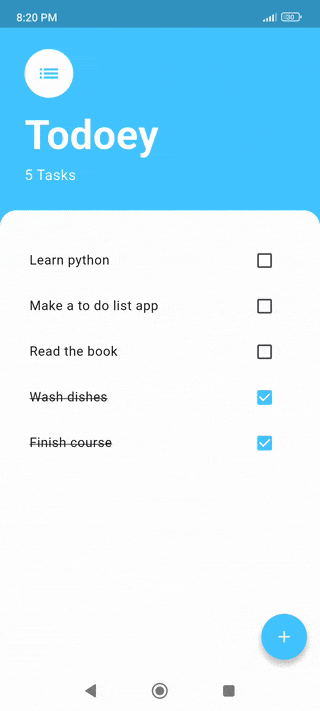
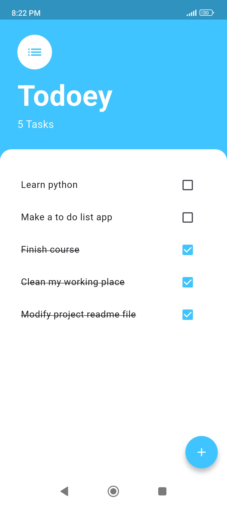
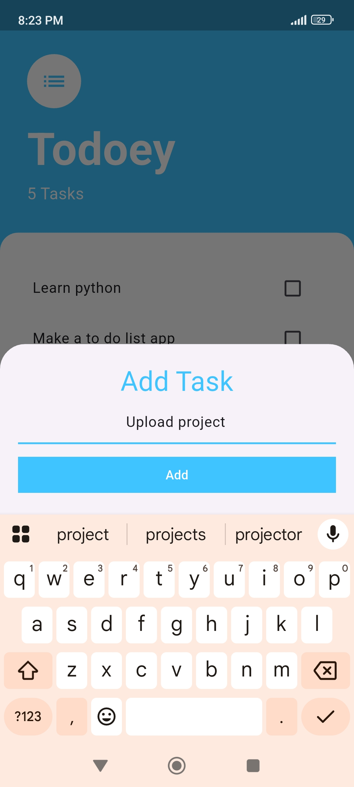

# 📝 Todoey - Task Manager App

A simple and elegant to-do list app built with Flutter, created as part of a Flutter development course.

## 📚 About the Project

**Todoey** is a productivity app that allows users to add, complete, and delete daily tasks. It demonstrates how to manage app state efficiently using the Provider package.

## 🎯 Course Objective

This project focuses on **state management**, **user interaction**, and **clean UI design** using Flutter’s layout system and the Provider architecture.

## 🚀 What I Learned

By creating this app, I learned:

- 🔄 How to use the **provider** package for state management
- 🧠 The concept of **ChangeNotifier** and **Consumer** widgets
- 📱 How to build **dynamic lists** with ListView and ListTile
- ➕ How to create **custom modal bottom sheets**
- ✍️ How to handle **user input** via TextFields and FloatingActionButton
- 🧼 How to refactor code using **model-view separation**
- 🔁 How to update UI reactively when the state changes

---

## 🖼️ App Preview
<table>
  <tr>
    <td align="center"><strong>Demo</strong> </td>
    <td align="center"><strong>Task list screen</strong> </td>
    <td align="center"><strong>Add task modal screen</strong> </td>
  </tr>
</table>

---

## 🛠️ Built With

- [Flutter](https://flutter.dev/)
- [Dart](https://dart.dev/)

---

## 📦 Packages

- [provider](https://pub.dev/packages/provider) – Used for app-wide state management in a clean, scalable way.

---
